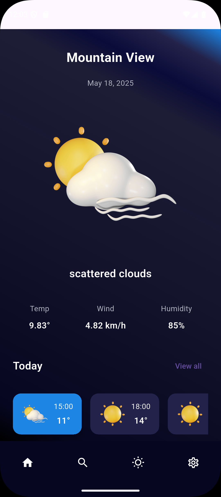
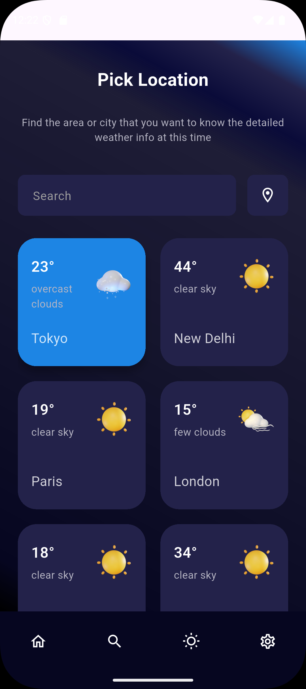

# ⛅ Weather App (Learning Project)

## Description
This project is a straightforward weather application developed using Flutter. It utilizes the Weather API to retrieve and display current weather data. Created primarily for learning purposes to practice Flutter UI development and API consumption.\

## Screenshots

## Resources
Youtube: [Flutter Weather App Tutorial | Dio x Riverpod Tutorial for beginners](https://youtu.be/msoKuk-5QFg)